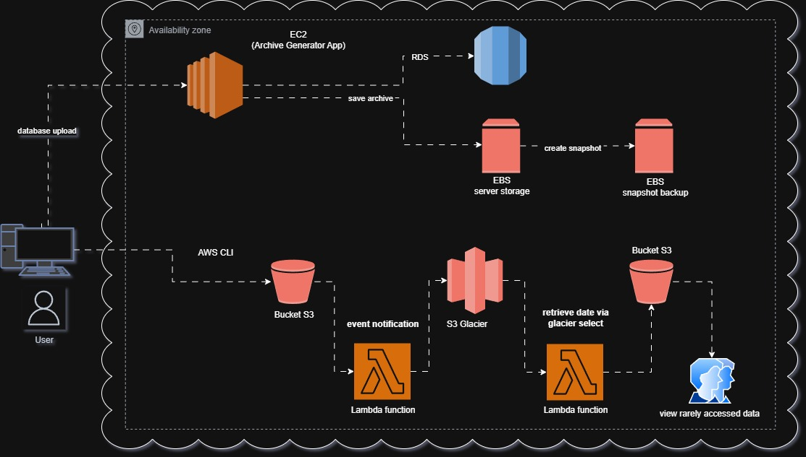

# **CRIANDO UMA ARQUITETURA NA NUVEM USANDO EC2 E S3**

## Simulação de processamento e armazenamento de dados de uma empresa de varejo.

### O usuário usa a interface para fazer upload de dados de compras e serviços da empresa que são processados por uma EC2 guardando os dados num EBS, usando o snapshot é feito backup dos dados ao final do dia en outro EBS.

### O sistema da vendas da loja armazena dados das compras diárias num S3, onde é usada uma função Lambda para guardar os dados num S3 Glacier para consulta no final de um perído longo de armazenamento.

